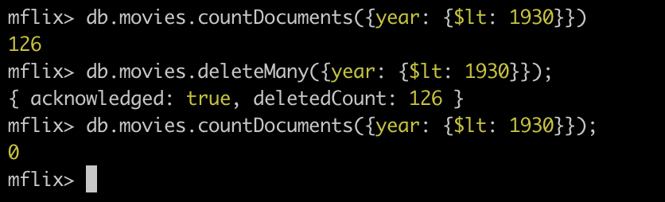

# Базовые запросы к MongoDB

## Задание

- [x] установить MongoDB в ВМ В GCP
- [x] заполнить данными в какой-либо предметной области, например интернет-магазин;
- [x] написать несколько запросов на выборку, обновление и удаление данных

## Описание выполнения

### 1 Этап

Я выполнил ещё в прошлом ДЗ.

### 2 Этап

С помощью комманд:

```js
use mflix

db.createCollection("comments")
db.createCollection("movies")
db.createCollection("sessions")
db.createCollection("theaters")
db.createCollection("users")
```

, я создал базу данный **mflix**, и в ней создал коллекции: **comments**, **movies**, **sessions**, **theaters**, **users**. И из репозитория <https://github.com/neelabalan/mongodb-sample-dataset/tree/main/sample_mflix> я скачал данные.

### 3 Этап

#### Выборка (find)

```js
// Чтобы узнать сколько элементов я выполнил комманду
db.users.count();
// Понял что она Deprecated, и выполнил следущию комманду
db.users.countDocuments();
```


```js
db.movies.find().limit(8);
```


```js
// Далее я поигрался со skip, limit и выборкой только некоторых полей
db.movies.find({}, { title: 1, genres: 1, countries: 1, year: 1 }).limit(3);
db.movies
  .find({}, { title: 1, genres: 1, countries: 1, year: 1 })
  .skip(2)
  .limit(3);
```


```js
db.movies
  .find(
    {
      genres: { $in: ["Comedy", "Family", "Fantasy"] },
      year: { $gte: 2000 },
    },
    { _id: -1, genres: 1, year: 1, title: 1, imdb: 1 }
  )
  .sort({ year: -1, title: 1 });
```


```js
// Использовал в фильтрах $or и $and
db.movies
  .find(
    {
      $or: [
        { $and: [{ year: { $lte: 1990 } }, { year: { $gte: 1989 } }] },
        { year: { $gt: 2000 } },
      ],
    },
    { title: 1, year: 1 }
  )
  .sort({ year: 1 });
```


#### Обновление

```js
// Обновленно использую updateOne
db.users.updateOne(
  { _id: ObjectId("59b99dbecfa9a34dcd7885c9") },
  { $set: { name: "Davos ..." } }
);
```


```js
// Обновленно используя updateMany
db.users.updateMany(
  { _id: ObjectId("59b99dbecfa9a34dcd7885c9") },
  { $set: { email: "davos@example.com", password: "supersecretpass" } }
);
```


#### Удаление

```js
// Удаление используя deleteMany
db.movies.deleteMany({ year: { $lt: 1930 } });
```



```js
// Удаление используя deleteOne
db.users.deleteOne({ name: { $regex: "^A" } });
```


